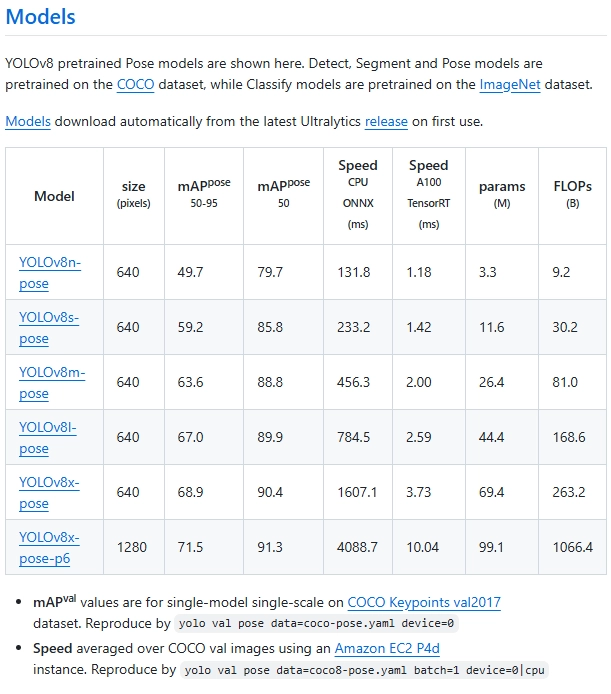
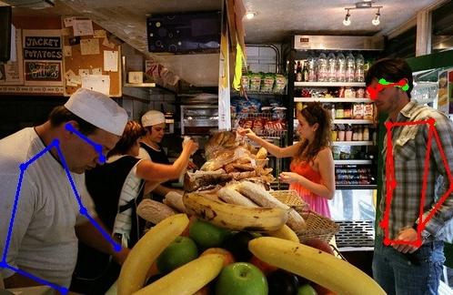
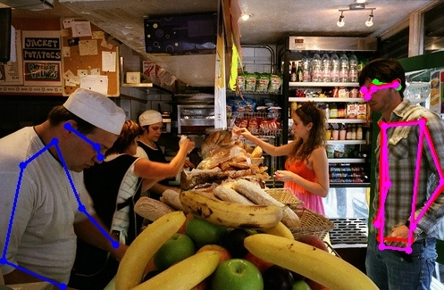

파일명: Jetson_Model_Comparison.ipynb

- 모델: Yolov8n-pose, Yolov8s-pose, Movenet
- Yolov8 모델 중에서 n이 nano, s가 small
- 벤치마크 코드

## MoveNet model
- 사전학습된 모델로, Single-person 탐지에 유리함.

## YOLOv8 model
- 사전 학습된 pose 모델.
- Multi-person 탐지에 유리
- 탐지(detect), 분할(Segment), 자세(Pose) 모델은 COCO 데이터셋에서 사전학습되었고, 분류(Classify) 모델은 Imagenet 데이터셋에서 사전학습되었음.

## 코드 실행 결과

# 랜덤 이미지 100장
    
    ========== 다중 모델 속도 및 정확도 벤치마크 시작 (100장) ==========
    ... [100/100] 평가 완료
    
    ==================================================
    속도 및 정확도 통합 벤치마크 최종 리포트
    
    [MoveNet]
    ====================속도 관점=====================
    - 평균 처리 속도 : 44.5 FPS
    - 객체 탐지 실패율: 0.0 %
    ===========정확도 관점 (높을수록 좋음)=============
    - OKS 종합 점수 : 34.2 점
    - PCK (보이는 관절): 50.9 %
    - PCK (가려진 관절): 71.4 %
    
    [YOLOv8-Pose (Nano)]
    ====================속도 관점=====================
    - 평균 처리 속도 : 39.1 FPS
    - 객체 탐지 실패율: 1.0 %
    ===========정확도 관점 (높을수록 좋음)=============
    - OKS 종합 점수 : 50.8 점
    - PCK (보이는 관절): 62.1 %
    - PCK (가려진 관절): 71.5 %
    
    [YOLOv8-Pose (Small)]
    ====================속도 관점=====================
    - 평균 처리 속도 : 38.0 FPS
    - 객체 탐지 실패율: 1.0 %
    ===========정확도 관점 (높을수록 좋음)=============
    - OKS 종합 점수 : 61.6 점
    - PCK (보이는 관절): 72.5 %
    - PCK (가려진 관절): 81.5 %

-----------------------------------------------------------------------------------------------------------

# 랜덤 이미지 500장
    
    ==================================================
    속도 및 정확도 통합 벤치마크 최종 리포트
    
    [MoveNet]
    ====================속도 관점=====================
    - 평균 처리 속도 : 44.9 FPS
    - 객체 탐지 실패율: 0.0 %
    ===========정확도 관점 (높을수록 좋음)=============
    - OKS 종합 점수 : 31.9 점
    - PCK (보이는 관절): 48.4 %
    - PCK (가려진 관절): 71.5 %
    
    [YOLOv8-Pose (Nano)]
    ====================속도 관점=====================
    - 평균 처리 속도 : 38.5 FPS
    - 객체 탐지 실패율: 1.4 %
    ===========정확도 관점 (높을수록 좋음)=============
    - OKS 종합 점수 : 57.6 점
    - PCK (보이는 관절): 72.3 %
    - PCK (가려진 관절): 82.3 %
    
    [YOLOv8-Pose (Small)]
    ====================속도 관점=====================
    - 평균 처리 속도 : 37.7 FPS
    - 객체 탐지 실패율: 0.8 %
    ===========정확도 관점 (높을수록 좋음)=============
    - OKS 종합 점수 : 63.6 점
    - PCK (보이는 관절): 76.5 %
    - PCK (가려진 관절): 85.9 %

--------------------------------------------------------------------------------------------------------------------------------------

- 예시 이미지로 한장 출력해봄
- GT(파란색): 가장 큰사람
- YOLOv8n-Pose (빨간색): 첫번째 탐지된 사람
- YOLOv8s-Pose(보라색)
- MoveNet(초록색): multi-person 상황에서 → **중앙 사람만 추정**

⇒ 해당 이미지는 multi-person 상황으로, 탐지 결과가 공정하지 못함. 하지만 현재 프로젝트 주제는 독거노인과 같은 single-person 상황이기 때문에,
single-person 상황일때의 정확도를 우선순위하기 때문에 YOLOv8 모델로 고려.

## 결과

- YOLOv8s-Pose 모델이 가장 우수하나, 젯슨 나노에서 작동할 것을 고려하여 YOLOv8n-Pose 모델로 결정
